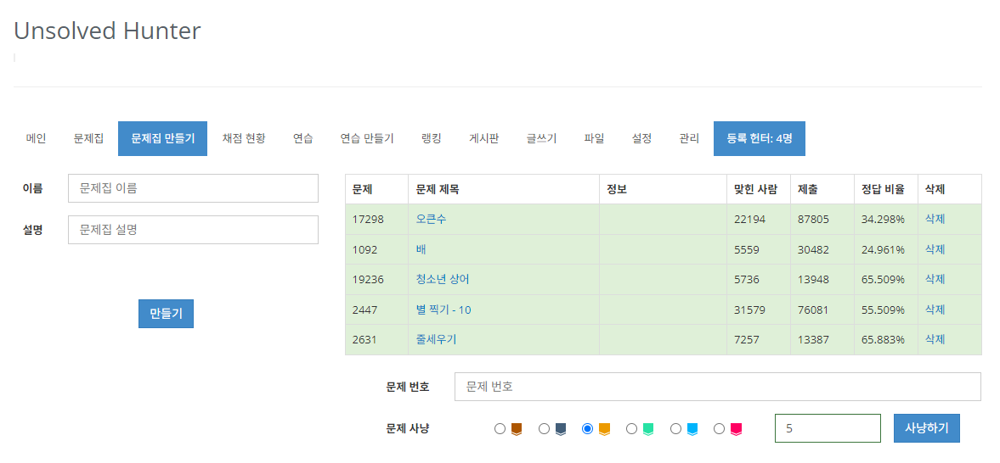

#  Unsolved Hunter 
[](#) [](#)

Unsolved Hunter는 BOJ 그룹에서 구성원들이 모두 풀지 않은 문제를 무작위로 선별해서 문제집에 등록해주는 확장 프로그램입니다.



# Features
- [문제집 문제 선별](./docs/instructions/workbook.md)
- [연습 문제 선별(추가 예정)](#)
- [오늘의 문제(추가 예정)](#)

# Build
```
npm install
npm run build chrome
npm run build firefox
```


