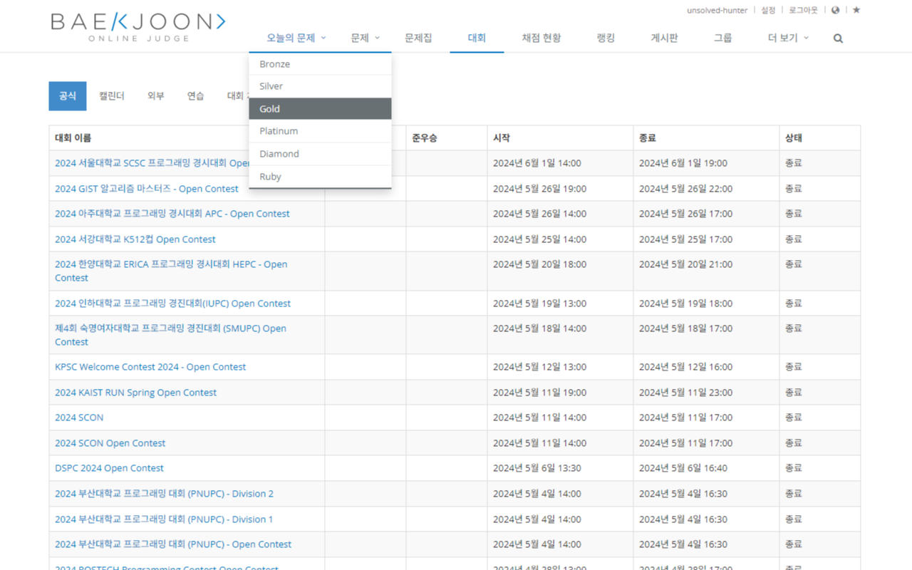

#  오늘의 문제

## 목차

1.  [사용법](#사용법)
2.  [개발 의도](#개발-의도)
3.  [참고 사항](#참고-사항)

### 사용법

#### 오늘의 문제 사냥하기

- 사이트 상단에 있는 오늘의 문제 메뉴에서 해당 티어를 클릭하면 문제 페이지로 이동합니다.

### 개발 의도

- 알고리즘 문제를 풀 때, 티어 별로 랜덤한 문제를 풀고 싶을 때 사용하기 위해 개발했습니다.
- 클릭 한번으로 내가 안 푼 문제 하나를 간편하게 제공받을 수 있습니다.
- 많은 사람이 풀어 이미 검증된 문제를 선택하는 게 알고리즘 공부하는 데 도움이 될 것으로 판단해서 푼 사람 수가 많은 문제를 먼저 선택하도록 구현했습니다.

### 참고 사항

- 문제 선별 기준은 다음과 같습니다.

1.  해당 티어
2.  사용자가 안 푼 문제
3.  푼 사람 수가 많은 순
4.  상위 50개 중 하나를 무작위로 선택

- 4번 항목 때문에 티어 별로 상위 50개의 문제를 풀지 않으면 항상 같은 범위의 문제가 선택됩니다.
- 이를 방지하기 위해 문제를 선택하는 범위를 늘릴 계획이 있습니다.
