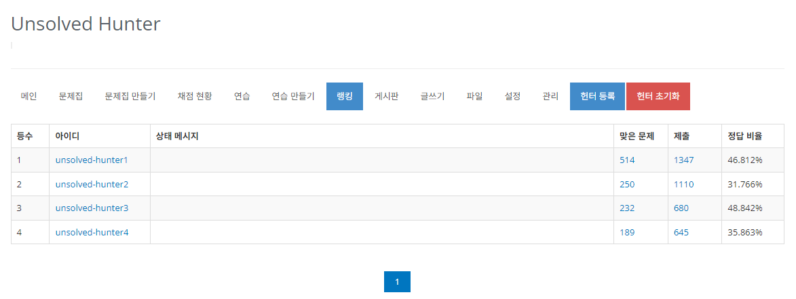
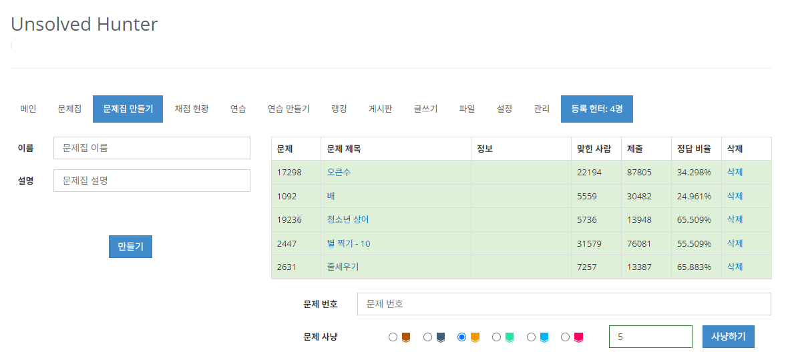

#  문제집 문제 사냥

## 목차

1.  [사용 방법](#사용-방법)
2.  [개발 의도](#개발-의도)
3.  [제약 사항](#제약-사항)
4.  [참고 사항](#참고-사항)

### 사용 방법

#### 1. 헌터 등록하기

- BOJ 그룹 랭킹 탭에서 오른쪽 '헌터 등록' 버튼을 누릅니다.
- 헌터 초기화로 헌터를 등록하지 않고 문제를 선별할 수도 있습니다.

#### 2. 등록 확인 및 문제 사냥하기

- 오른쪽 끝에서 등록 헌터의 수를 확인할 수 있습니다.

- 티어를 선택하고, 문제 개수를 입력 후 사냥하기를 누르면 문제가 자동으로 등록됩니다.

### 개발 의도

- BOJ 그룹에서 알고리즘 문제를 선별할 때, 구성원들이 이미 푼 문제를 제외하고 문제를 선별해야 합니다.
- 문제 선별은 sovled.ac의 검색을 이용하면 되는데, 검색 쿼리에 유저명을 일일이 넣어줘야 하기 때문에 이 부분을 자동화했습니다.
- 이를 통해 반복 작업을 제거했고, 무작위로 선별하기 때문에 무슨 문제를 풀지 고민하는 시간을 줄여줍니다.
- 많은 사람이 풀어 이미 검증된 문제를 선별하는 게 알고리즘 공부하는 데 도움이 될 것으로 판단해서 푼 사람 수가 많은 문제를 먼저 선별하도록 구현했습니다.

### 제약 사항

- solved.ac 검색 api를 기반으로 첫 번째 페이지에서 문제를 가져오기 때문에 한 번에 최대 50개로 제한됩니다.
- 검색 쿼리의 길이 제한이 있어 헌터 수가 약 40명 이상일 때부터, 검색할 수 없는 경우가 존재합니다.

### 참고 사항

- 문제 선별 기준은 다음과 같습니다.

1.  해당 티어
2.  모든 헌터가 안 푼 문제
3.  푼 사람 수가 많은 순
4.  상위 50개 중 입력 개수만큼 무작위로 선별

- 4번 항목 때문에 티어 별로 상위 50개의 문제를 풀지 않으면 항상 같은 범위의 문제가 선별됩니다.
- 이를 방지하기 위해 문제를 선별하는 범위를 늘릴 계획이 있습니다.
